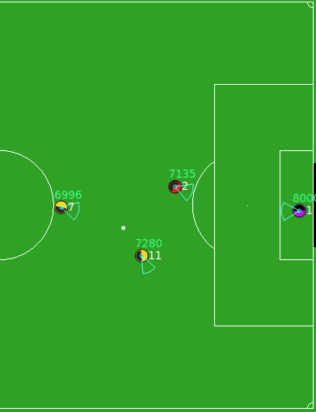

# Ad hoc teamwork using approximate representations
#### (Project for Master's Dissertation (MEIC) @ IST 2021/2022)

  

## Abstract
The mass production of technological systems around the world is both an economic and ecological issue we face today. It is critical that we find alternate solutions as soon as possible, to contribute to a more sustainable society. An emerging field that can bring some advancements towards this goal is that of ad hoc teamwork, which studies how an agent can be integrated in a new team without prior knowledge of its new teammates. Such agents would be reusable in future tasks, reducing the need to create such a huge amount of agents. Recent advances in this field shown that it is possible to design agents capable of achieving high performance in this task. However, none of the existing approaches tackled this problem for large domains with partial observability. In this paper, we present a new algorithm, Partially Observable Plastic Policy (POPP), that combines transfer learning with Deep Recurrent Q-Networks, by having an agent learn policies to play along with different types of teammates, and reusing that knowledge when faced with new teams. We chose the Half-Field Offense domain for evaluation. We experiment with different configurations, with and without partial observability, and with known and unknown teammates. Finally, we present and discuss our results, and compare them to non-recurrent approaches, namely Deep Q-Networks (DQN). We concluded that POPP was able to quickly identify most of the previously known teams, and surpassed the score rate of a DQN approach in partially observable scenarios.

## Links
- [Dissertation Website](https://fenix.tecnico.ulisboa.pt/cursos/meic-t/dissertacao/846778572213921)
- [Thesis](Documents/90714-filipe-sousa-dissertacao.pdf)
- [Extended Abstract](Documents/90714-filipe-sousa-resumo.pdf)
